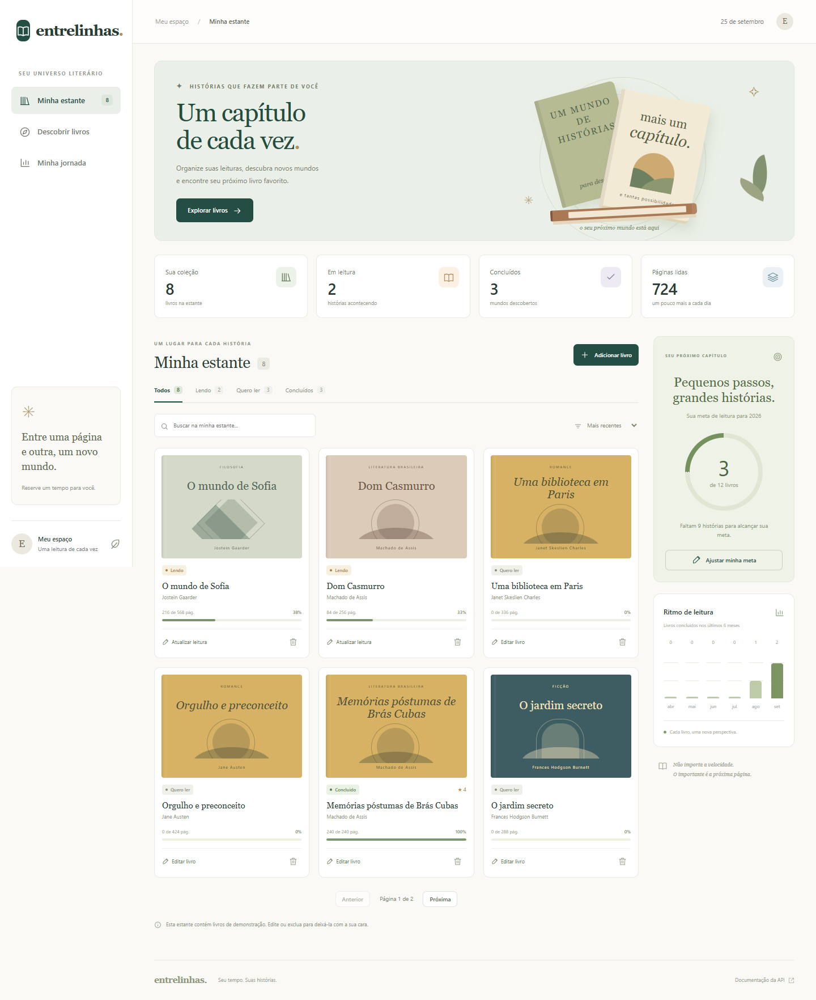
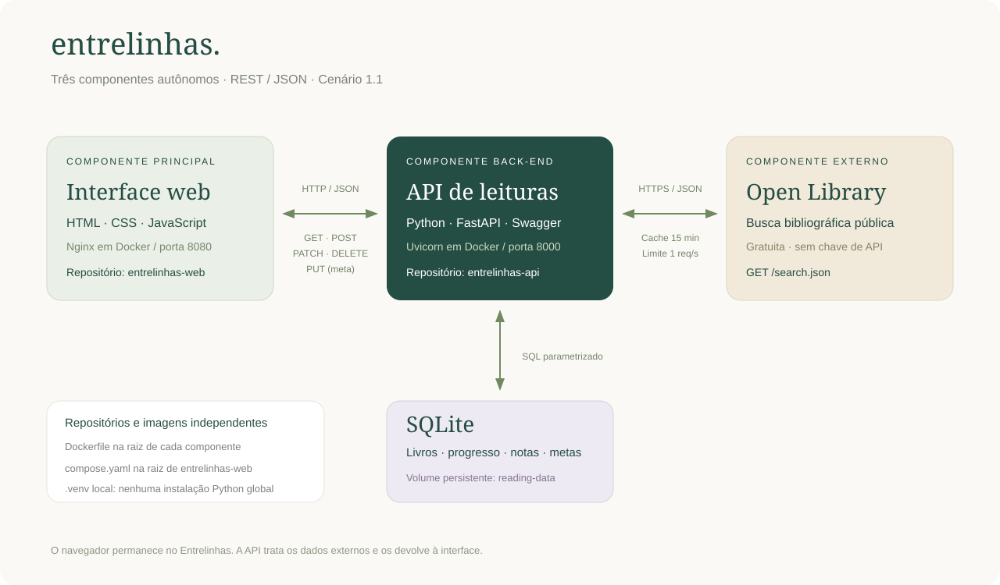

# Entrelinhas · Interface web

Um espaço pessoal para organizar a estante, descobrir livros e acompanhar o hábito da leitura. Projeto acadêmico original no domínio de leitura, seguindo o **cenário 1.1** do enunciado: **interface → API própria → API externa**.



## Funcionalidades

- Estante com cadastro, edição e exclusão confirmada de livros.
- Situações **Quero ler**, **Lendo** e **Concluído**, com progresso de páginas.
- Notas pessoais e avaliação de 1 a 5 estrelas.
- Busca por título/autor sem distinguir acentos, filtros, ordenação e paginação.
- Descoberta no Open Library e importação de metadados sem sair da aplicação.
- Meta anual persistente, painel de indicadores e gráfico dos últimos seis meses.
- Interface responsiva, formulários acessíveis, feedback de sucesso/erro e estados vazios.
- Sem framework, Node.js, npm, fontes externas ou dependências JavaScript. Ilustrações e capas decorativas feitas em CSS; não reproduzem capas comerciais.

## Arquitetura



| Componente | Responsabilidade | Execução |
| --- | --- | --- |
| `entrelinhas-web` | Interface principal em HTML/CSS/JavaScript; consome REST | Nginx/Docker em `8080` ou servidor estático Python |
| `entrelinhas-api` | Regras, CRUD, estatísticas, metas, integração externa | Python/FastAPI em `8000`, repositório separado |
| Open Library | Catálogo bibliográfico público, mantido por terceiros | `https://openlibrary.org/search.json` |
| SQLite | Persistência interna da API; não é contado como componente externo | Arquivo local / volume Docker |

Os componentes próprios funcionam como serviços separados. O código da interface não lê o banco. As chamadas saem do navegador para a API via REST/JSON, com CORS restrito às origens locais. A API consulta o catálogo externo por HTTPS, transforma a resposta e envia os metadados para a interface. A consulta **não redireciona** para outra aplicação.

## Instalação local com ambiente virtual

Pré-requisitos: **Python 3.13** e navegador moderno. O front-end não precisa de bibliotecas Python; pode compartilhar o ambiente virtual da API.

Mantenha os repositórios como pastas irmãs:

```text
projeto/
├── .venv/
├── entrelinhas-web/   ← este repositório
└── entrelinhas-api/   ← repositório da API
```

Na pasta `projeto`, usando PowerShell:

```powershell
python -m venv .venv
.\.venv\Scripts\python.exe -m pip install --no-cache-dir -r .\entrelinhas-api\requirements.lock
```

Em um terminal, inicie a API:

```powershell
cd entrelinhas-api
..\.venv\Scripts\python.exe -m uvicorn app.main:app --host 127.0.0.1 --port 8000
```

Em outro terminal, na pasta da interface:

```powershell
cd entrelinhas-web
..\.venv\Scripts\python.exe serve.py
```

Acesse **http://localhost:8080**. Swagger em **http://localhost:8000/docs**. Para encerrar, pressione `Ctrl+C` em cada terminal. Não é preciso ativar o ambiente virtual nem alterar a política de execução do PowerShell.

Em Linux/macOS, use `python3 -m venv .venv` e substitua `..\.venv\Scripts\python.exe` por `../.venv/bin/python`.

### Dados de demonstração

O banco começa vazio. Opcionalmente, na pasta da API, execute:

```powershell
..\.venv\Scripts\python.exe -m app.seed
```

São oito registros explicitamente demonstrativos, inseridos apenas se a estante estiver vazia. Os dados não são resultados fictícios da API externa. O rodapé da estante informa quando há exemplos. Páginas e progresso são ilustrativos; confira a edição ao usar seus próprios livros.

### Configuração

`config.js` define `window.ENTRELINHAS_CONFIG.apiBaseUrl`. Por padrão, usa o hostname da interface e a porta `8000`. Para outra implantação, altere esse endereço e configure `CORS_ORIGINS` na API. A interface foi preparada para uso pessoal local; não possui contas de usuários.

## Execução com Docker

Pré-requisito: Docker Engine/Desktop com Compose instalado e em execução. No Windows, o Docker Desktop precisa de virtualização/WSL2 conforme a [documentação oficial](https://docs.docker.com/desktop/setup/install/windows-install/).

Na raiz **deste repositório**, com `entrelinhas-api` como pasta irmã:

```powershell
docker compose up --build -d
docker compose ps
```

- Interface: http://localhost:8080
- Swagger: http://localhost:8000/docs
- Saúde: http://localhost:8000/health
- Inserir exemplos, opcional: `docker compose exec api python -m app.seed`
- Logs: `docker compose logs -f`
- Parar: `docker compose down`

O arquivo `compose.yaml` está na raiz do componente principal, como pede o enunciado. Cada componente possui seu próprio Dockerfile e contexto de build. O volume nomeado `reading-data` preserva o SQLite entre reinicializações e recriações dos containers. `docker compose down` mantém os dados; a opção `-v` remove o volume e só deve ser usada quando a exclusão for desejada.

Para executar somente a interface em container, mantendo uma API disponível na porta 8000:

```powershell
docker build -t entrelinhas-web .
docker run --rm -p 127.0.0.1:8080:80 entrelinhas-web
```

## Chamadas HTTP feitas pela interface

| Ação visível | Método e rota |
| --- | --- |
| Abrir a estante, filtrar, ordenar, paginar | `GET /books` |
| Abrir formulário de edição | `GET /books/{id}` |
| Salvar novo livro / importar resultado | `POST /books` |
| Salvar alterações e atualizar progresso | `PATCH /books/{id}` |
| Confirmar exclusão | `DELETE /books/{id}` |
| Salvar meta anual | `PUT /goal` |
| Atualizar indicadores, gráfico e meta | `GET /stats` |
| Buscar título/autor externo | `GET /catalog/search` |

Os cinco métodos HTTP exigidos/alternativos são usados de fato pelos controles da interface. Não há persistência simulada no navegador: livros e metas vivem no SQLite.

## API externa: Open Library

- **Serviço:** catálogo bibliográfico do Open Library/Internet Archive.
- **Custo e acesso:** consulta pública gratuita; a rota usada não requer conta, token ou chave de API.
- **Rota:** `GET https://openlibrary.org/search.json`.
- **Parâmetros:** `q`, `page`, `limit`, `lang=pt` e `fields=key,title,author_name,first_publish_year,number_of_pages_median`.
- **Dados utilizados:** título, autoria, identificador da obra, primeiro ano de publicação e mediana de páginas, quando presentes. O usuário confirma as páginas da edição antes de salvar.
- **Tratamento:** timeout de 15 segundos, cache de 15 minutos limitado a 128 consultas, serialização e intervalo mínimo de 1,05 segundo entre chamadas externas. Uma instância/worker por padrão. Falhas retornam HTTP 503 com orientação na interface; não há substituição silenciosa por resultados inventados.
- **Identificação:** `User-Agent` identifica o projeto. Para uso frequente, configure `OPEN_LIBRARY_USER_AGENT` com seu contato, conforme a orientação oficial; o projeto continua limitado a uma chamada por segundo por processo.
- **Licença de uso:** a página oficial de licenciamento informa que o Internet Archive não reivindica novos direitos sobre a base, mas que contribuições podem ter direitos preexistentes. Não se presume que livros ou capas sejam de domínio público. O projeto consome metadados e desenha suas próprias capas decorativas; não distribui textos integrais nem imagens de capas.

Fontes oficiais: [API e política de uso](https://openlibrary.org/developers/api), [Search API](https://openlibrary.org/dev/docs/api/search), [licenciamento](https://openlibrary.org/developers/licensing). Consultadas em 25/09/2026.

## Estrutura

```text
entrelinhas-web/
├── Dockerfile              # container Nginx
├── compose.yaml            # orquestração na raiz do componente principal
├── nginx.conf              # servidor em container
├── serve.py                # servidor local, biblioteca padrão
├── index.html
├── styles.css              # layout, responsividade, capas em CSS
├── config.js               # endereço da API
├── js/
│   ├── api.js              # cliente HTTP e erros
│   ├── app.js              # estado e interações
│   └── ui.js               # componentes visuais reutilizáveis
├── assets/favicon.svg
├── docs/                   # arquitetura, evidências e entrega
└── tests/browser_check.py  # fluxos reais com banco temporário
```

## Teste de navegador

Com os dois componentes como pastas irmãs e os servidores parados:

```powershell
..\.venv\Scripts\python.exe -m pip install --no-cache-dir playwright==1.63.0
..\.venv\Scripts\python.exe tests\browser_check.py
```

O teste usa o **Google Chrome já instalado**, sem baixar navegador, e cria um banco temporário. Verifica CRUD real, persistência, filtros, paginação, meta, importação, duplicidade, falha externa, tratamento de texto não confiável e layout móvel. A consulta externa é controlada apenas nesse teste para torná-lo repetível. A integração real é verificada separadamente; veja [validação](docs/VALIDACAO.md).

## Entrega acadêmica

Veja [matriz de requisitos](docs/REQUISITOS.md), [roteiro de vídeo de 5min40s](docs/ROTEIRO_VIDEO.md), [publicação dos dois repositórios](docs/PUBLICACAO.md) e [modelo de mensagem](docs/ENTREGA.md).

**Pendências externas:** publicar os dois repositórios públicos, executar/validar os containers em um ambiente com Docker e gravar/publicar o vídeo. A existência destes arquivos não equivale à conclusão dessas etapas.
